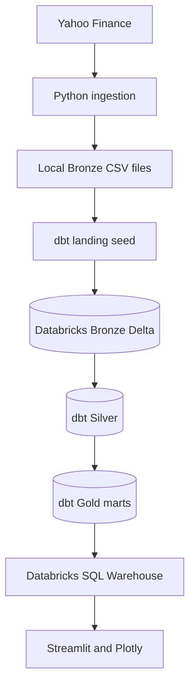

# ETF Market Intelligence Pipeline

[](https://github.com/Hamza-Abbas/ETF-Market-Intelligence-Pipeline)
[](https://www.python.org/)
[](https://www.getdbt.com/)
[](https://www.databricks.com/)
[](https://streamlit.io/)

An end-to-end Data Engineering portfolio project that ingests daily ETF market data from Yahoo Finance, incrementally loads it into Databricks, transforms it through a **Bronze → Silver → Gold Medallion Architecture** with dbt, and serves analytics through an interactive Streamlit and Plotly dashboard.

The project tracks **20 USD-listed ETFs** across US, global, international, emerging-market, technology, bond, and commodity exposures.

> **Project status — in progress:** Historical ingestion, Databricks Medallion layers, dbt models and tests, five analytical Gold marts, and the Streamlit dashboard are complete. The latest-day extractor and dbt incremental Bronze model are implemented. Manual end-to-end validation, local scheduling, dashboard auto-refresh, and Gmail notifications are the next milestone.

## Project Snapshot

Validated on **22 July 2026** before the local automation phase:

| Metric | Current value |
| --- | ---: |
| ETFs tracked | 20 |
| Bronze price records | 58,060 |
| Historical range | 2015-01-02 to 2026-07-21 |
| Duplicate `(symbol, price_date)` keys | 0 |
| dbt models | 7 |
| dbt data tests | 85 |
| Gold analytical marts | 5 |
| Databricks storage format | Delta |
| Dashboard views | 5 |

These figures describe the current development dataset and will grow as daily incremental loads are activated.

## Why This Project Matters

This project demonstrates practical Data Engineering and Analytics Engineering skills:

- building configuration-driven Python ingestion pipelines;
- separating historical bootstrap and daily incremental processing;
- implementing idempotent Delta Lake loads with dbt `MERGE`;
- applying Medallion Architecture in Databricks;
- creating modular SQL transformations and analytical marts;
- enforcing data quality at documented table grains;
- preserving audit metadata with batch IDs and ingestion timestamps;
- serving warehouse data through an interactive analytics application;
- preparing a batch pipeline for scheduling, monitoring, and alerting.

## Architecture



### Historical Bootstrap

The initial historical load fetched daily OHLCV prices from 2015 onward, validated each local file, combined the data, and loaded the original Bronze table. This established the **58,060-row baseline** currently stored in Databricks.

```text
yfinance historical download
        → partitioned local Bronze CSV files
        → validation and combined bootstrap dataset
        → Databricks Bronze Delta table
```

### Daily Incremental Design

The current incremental implementation requests the newest available daily candle for each configured ETF and creates a small landing batch.

```text
Latest daily ETF records
        → seeds/etf_prices_incremental.csv
        → temporary dbt landing table
        → dbt incremental MERGE
        → bronze.etf_prices_raw
        → Silver and Gold refresh
        → Streamlit dashboard
```

The Bronze model uses:

- `materialized='incremental'`;
- `incremental_strategy='merge'`;
- `unique_key=['symbol', 'price_date']`;
- Delta Lake storage;
- a filter that accepts records newer than the current Bronze maximum date;
- `full_refresh=false` to protect the historical table from accidental rebuilds.

This makes the warehouse load idempotent: rerunning a batch does not create a second record for the same ETF and trading date.

## Medallion Architecture

| Layer | Purpose | Main output |
| --- | --- | --- |
| Bronze | Preserve source values and ingestion metadata at daily ETF grain | `bronze.etf_prices_raw` |
| Silver | Clean, standardize, validate, and calculate daily price movements | `silver.etf_prices_cleaned` |
| Gold | Publish business-ready performance, market, risk, and alert datasets | Five analytical marts |
| Serving | Query curated Gold data through Databricks SQL | Streamlit dashboard |

### Bronze Layer

The Bronze Delta table keeps the original market fields together with operational metadata:

```text
symbol, price_date, open, high, low, close, adjusted_close, volume,
source_provider, load_type, batch_id, ingested_at_utc
```

Its documented grain is:

```text
one row per ETF per trading date
```

### Silver Layer

`silver.etf_prices_cleaned`:

- standardizes raw field names;
- removes records missing required business fields;
- rejects invalid ranges where `high < low`;
- calculates the previous adjusted closing price;
- calculates daily return and daily return percentage;
- adds a five-trading-day adjusted-close comparison;
- preserves source and batch lineage for traceability.

### Gold Analytical Marts

| Model | Grain | Business purpose |
| --- | --- | --- |
| `etf_long_term_performance` | One row per ETF | First/latest prices and total return since 2015 |
| `etf_month_by_month_performance` | One row per ETF per month | Monthly movement, return, and trading-day count |
| `etf_monthly_market_summary` | One row per month | Market breadth, average return, and monthly leaders |
| `etf_risk_summary` | One row per ETF | Volatility, positive-month ratio, and return-to-risk metrics |
| `etf_alert_candidates` | One row per qualifying ETF/month | Strong gains, sharp drops, and momentum events |

Current alert rules:

| Monthly return | Alert type | Severity |
| ---: | --- | :---: |
| `>= 8%` | `STRONG_GAIN` | High |
| `<= -8%` | `SHARP_DROP` | High |
| `>= 4%` | `POSITIVE_MOMENTUM` | Medium |
| `<= -4%` | `NEGATIVE_MOMENTUM` | Medium |

The alert mart currently supports dashboard analysis. Email delivery is part of the next phase.

## Streamlit Dashboard

The Streamlit application connects to the Databricks SQL Warehouse and reads curated Gold tables rather than querying raw CSV files.

It provides five analytical views:

- **Overview:** coverage, freshness, performance ranking, market breadth, and risk-return positioning;
- **ETF Explorer:** adjusted-price history, monthly returns, normalized growth, return heatmaps, and CSV export;
- **Risk & Return:** volatility, positive-month ratios, return-to-risk comparison, and detailed metrics;
- **Market History:** monthly return ranges, breadth trends, and winner history;
- **Alerts:** severity and alert-type filters, latest events, distributions, and CSV export.

ETF symbols are mapped to full business-friendly names and classifications through a separate metadata configuration. Query results are cached for five minutes, and the current dashboard includes a manual **Refresh from Databricks** action.

## ETF Universe

| Symbol | ETF |
| --- | --- |
| VOO | Vanguard S&P 500 ETF |
| SPY | SPDR S&P 500 ETF Trust |
| QQQ | Invesco QQQ Trust |
| VGT | Vanguard Information Technology ETF |
| VT | Vanguard Total World Stock ETF |
| VXUS | Vanguard Total International Stock ETF |
| BND | Vanguard Total Bond Market ETF |
| GLD | SPDR Gold Shares |
| VEA | Vanguard FTSE Developed Markets ETF |
| VWO | Vanguard FTSE Emerging Markets ETF |
| BNDX | Vanguard Total International Bond ETF |
| ACWI | iShares MSCI ACWI ETF |
| EFA | iShares MSCI EAFE ETF |
| IEMG | iShares Core MSCI Emerging Markets ETF |
| EWJ | iShares MSCI Japan ETF |
| MCHI | iShares MSCI China ETF |
| INDA | iShares MSCI India ETF |
| EWG | iShares MSCI Germany ETF |
| EWU | iShares MSCI United Kingdom ETF |
| EWZ | iShares MSCI Brazil ETF |

Symbols are maintained in `config/etf_symbols.yml`; names and classifications are maintained in `config/etf_metadata.yml`.

## Repository Structure

```text
daily_etf_market_intelligence_pipeline/
├── config/
│   ├── etf_symbols.yml
│   └── etf_metadata.yml
├── dashboard/
│   ├── app.py
│   └── services/
│       ├── databricks_service.py
│       └── metadata_service.py
├── data/                              # Generated locally; excluded from Git
│   ├── bootstrap/
│   └── bronze/
├── etf_intelligence_pipeline/
│   ├── dbt_project.yml
│   ├── macros/
│   ├── models/
│   │   ├── bronze/
│   │   │   └── etf_prices_raw.sql
│   │   ├── silver/
│   │   └── gold/
│   ├── seeds/
│   │   └── etf_prices_incremental.csv
│   └── tests/
├── src/
│   ├── ingestion/
│   │   ├── fetch_historical_prices.py
│   │   ├── fetch_incremental_prices.py
│   │   ├── check_bronze_files.py
│   │   └── create_databricks_upload_file.py
│   └── utils/
│       └── config_loader.py
├── .gitignore
├── pyproject.toml
├── uv.lock
└── README.md
```

## Local Setup

### Prerequisites

- Python 3.11 or newer
- [`uv`](https://docs.astral.sh/uv/)
- Git
- A Databricks workspace and SQL Warehouse
- dbt Core and `dbt-databricks`

### 1. Clone and install

```powershell
git clone https://github.com/Hamza-Abbas/ETF-Market-Intelligence-Pipeline.git
cd ETF-Market-Intelligence-Pipeline
uv sync
```

### 2. Configure dbt

Store the Databricks connection in `%USERPROFILE%\.dbt\profiles.yml`. Keep secrets out of the repository and reference environment variables where possible.

Validate the connection:

```powershell
cd etf_intelligence_pipeline
dbt debug
cd ..
```

### 3. Configure Streamlit

Create `.streamlit/secrets.toml` locally:

```toml
[databricks]
server_hostname = "YOUR_SERVER_HOSTNAME"
http_path = "/sql/1.0/warehouses/YOUR_WAREHOUSE_ID"
access_token = "YOUR_ACCESS_TOKEN"
catalog = "etf"
schema = "gold"
```

Never commit this file.

## Run the Daily Incremental Pipeline Manually

Run the extractor from the repository root:

```powershell
python .\src\ingestion\fetch_incremental_prices.py
```

Load the small landing batch and rebuild the dbt dependency graph:

```powershell
cd .\etf_intelligence_pipeline
dbt seed --select etf_prices_incremental --full-refresh
dbt run --select etf_prices_raw+
dbt test --select etf_prices_raw+
cd ..
```

The trailing `+` selects `etf_prices_raw` and every downstream Silver and Gold model that depends on it.

Start the dashboard:

```powershell
streamlit run .\dashboard\app.py
```

After a successful warehouse refresh, use **Refresh from Databricks** in the sidebar to clear the dashboard cache and rerun the queries.

## Data Quality

The project currently contains **85 dbt data tests**, supported by ingestion checks and custom SQL tests. They protect the pipeline's core assumptions:

- required symbols, dates, OHLCV values, and analytical fields are not null;
- `(symbol, price_date)` remains unique in Bronze and Silver;
- invalid daily price ranges are rejected;
- model grains remain stable across Silver and Gold;
- return, volatility, market-breadth, and alert fields satisfy business rules;
- the landing batch contains the expected configured ETFs before loading.

Example Bronze validation:

```sql
SELECT
    COUNT(*) AS total_rows,
    COUNT(DISTINCT symbol) AS total_symbols,
    MIN(price_date) AS earliest_date,
    MAX(price_date) AS latest_date
FROM etf.bronze.etf_prices_raw;
```

Duplicate-key check:

```sql
SELECT
    symbol,
    price_date,
    COUNT(*) AS row_count
FROM etf.bronze.etf_prices_raw
GROUP BY symbol, price_date
HAVING COUNT(*) > 1;
```

## Security

Never commit credentials or generated runtime artifacts. Keep the following outside version control:

- `.env`;
- `.streamlit/secrets.toml`;
- `%USERPROFILE%\.dbt\profiles.yml`;
- `.venv/`;
- `logs/`;
- dbt `target/` and `dbt_packages/`;
- generated Bronze datasets and bootstrap CSV files.

Before every push, inspect both unstaged and staged changes:

```powershell
git status --short
git diff
git diff --cached
```

## Current Delivery Status

| Capability | Status |
| --- | :---: |
| Historical ingestion for 20 ETFs | ✅ Complete |
| 58,060-row Bronze Delta baseline | ✅ Complete |
| Silver transformation layer | ✅ Complete |
| Five Gold analytical marts | ✅ Complete |
| 85 dbt data tests | ✅ Complete |
| Five-view Streamlit dashboard | ✅ Complete |
| Full ETF names and classifications | ✅ Complete |
| Latest-day Python extractor | ✅ Implemented |
| dbt incremental Bronze `MERGE` | ✅ Implemented |
| Manual end-to-end incremental validation | 🟡 In progress |
| Windows Task Scheduler orchestration | ⏳ Next |
| Gmail success/failure notifications | ⏳ Next |
| Dashboard automatic refresh | ⏳ Next |
| AWS EventBridge, Lambda, and SNS | 🗓️ Future |
| Public dashboard deployment | 🗓️ Future |

## Roadmap

### Phase 1 — Complete Local Automation

- validate the latest-day extraction and Delta `MERGE` end to end;
- create one orchestration script for extraction, dbt, tests, and validation;
- schedule weekday runs with Windows Task Scheduler;
- report success, no-new-data, and failure outcomes through Gmail;
- add dashboard auto-refresh or a controlled cache time-to-live.

### Phase 2 — Cloud Automation and Observability

- move scheduling to AWS EventBridge;
- run ingestion and transformation with an appropriate cloud execution service;
- publish selected notifications through AWS SNS;
- add structured run logs, freshness checks, and failure monitoring;
- prevent repeat notifications for previously processed alerts.

### Phase 3 — Deployment and Analytics Expansion

- deploy the Streamlit application;
- add dashboard and dbt-lineage screenshots to this README;
- extend analytics with drawdown, annualized volatility, volume, and rolling-return views.

## Author

**Hamza Abbas** — Aspiring Data Engineer focused on Python, SQL, dbt, Databricks, Snowflake, cloud data platforms, and analytics engineering.

- [LinkedIn](https://www.linkedin.com/in/hamza-abbas-data-engineer/)
- [GitHub](https://github.com/Hamza-Abbas)

## Disclaimer

This project is built for educational and Data Engineering portfolio purposes. It is not financial advice, investment research, or a recommendation to buy or sell any security.
