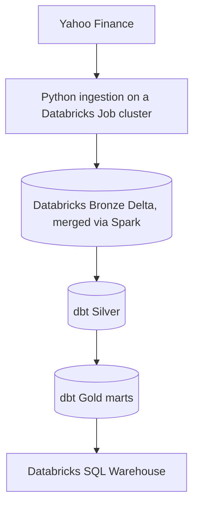

# ETF Market Intelligence Pipeline

[](https://github.com/Hamza-Abbas/ETF-Market-Intelligence-Pipeline)
[](https://www.python.org/)
[](https://www.getdbt.com/)
[](https://www.databricks.com/)

An end-to-end Data Engineering portfolio project that ingests daily ETF market data from Yahoo Finance, incrementally loads it into Databricks, and transforms it through a **Bronze → Silver → Gold Medallion Architecture** with dbt, all orchestrated end to end by a scheduled Databricks Job.

The project tracks **20 USD-listed ETFs** across US, global, international, emerging-market, technology, bond, and commodity exposures.

> **Project status — automated:** Historical ingestion, Databricks Medallion layers, dbt models and tests, and five analytical Gold marts are complete. A daily Databricks Job now runs the pipeline end to end on a schedule: the extractor merges straight into Bronze, then dbt builds and tests Silver and Gold. The earlier Streamlit prototype has been retired; a native Databricks dashboard on the Gold marts, refreshed by the same daily Job, is the next milestone.

## Project Snapshot

Validated on **24 July 2026**, the first day the full pipeline ran unattended on its Databricks schedule:

| Metric | Current value |
| --- | ---: |
| ETFs tracked | 20 |
| Bronze price records | 58,100 |
| Historical range | 2015-01-02 to 2026-07-23 |
| Duplicate `(symbol, price_date)` keys | 0 |
| dbt models | 6 |
| dbt data tests | 82 |
| Gold analytical marts | 5 |
| Databricks storage format | Delta |

These figures grow daily now that the incremental load runs automatically; treat them as a point in time snapshot rather than a fixed count.

## Why This Project Matters

This project demonstrates practical Data Engineering and Analytics Engineering skills:

- building configuration-driven Python ingestion pipelines;
- separating historical bootstrap and daily incremental processing;
- implementing idempotent Delta Lake `MERGE` loads directly from Spark, with no intermediate landing file;
- orchestrating scheduled pipelines with multiple dependent tasks in Databricks Jobs;
- applying Medallion Architecture in Databricks;
- creating modular SQL transformations and analytical marts;
- enforcing data quality at documented table grains;
- preserving audit metadata with batch IDs and ingestion timestamps;
- structuring curated Gold marts for downstream dashboards and reporting;
- preparing a batch pipeline for scheduling, monitoring, and alerting.

## Architecture



### Historical Bootstrap

`fetch_historical_prices.py` fetches the full daily OHLCV history for every configured ETF from 2015 onward and merges it straight into Bronze the same way the daily job does, no local CSV, no seed, a Spark `MERGE` from inside a Databricks Job task. This established the initial Bronze baseline, and because the merge is idempotent, the same script also works as a recovery tool: if the daily incremental job ever fails or misses a run, running this again backfills whatever is missing without creating duplicates.

```text
yfinance historical download (per ETF, from 2015)
        → pandas batch in memory
        → Spark DataFrame (temp view)
        → MERGE INTO bronze.etf_prices_raw
```

### Daily Incremental Design

The incremental implementation requests the newest available daily candle for each configured ETF and merges the batch straight into Bronze. There is no landing seed and no local CSV in this path: the ingestion script runs as a task on a Databricks Job cluster, builds a small Spark DataFrame from the day's batch, and issues a `MERGE INTO` against the Bronze table using the cluster's own Spark session, no external credentials required.

```text
Latest daily ETF records
        → pandas batch in memory
        → Spark DataFrame (temp view)
        → MERGE INTO bronze.etf_prices_raw
        → dbt build: Silver and Gold
```

The merge matches on `symbol` and `price_date`, updating existing rows and inserting new ones, so rerunning a batch never creates a duplicate record for the same ETF and trading date. `etf_prices_raw` is declared as a dbt **source** rather than a dbt model, since the Databricks Job populates it directly; Silver reads from that source with `{{ source('bronze', 'etf_prices_raw') }}`.

### Daily Orchestration

A single Databricks Job, `etf_daily_pipeline`, runs the whole thing on a schedule:

| Task | Type | What it does |
| --- | --- | --- |
| `fetch_incremental_prices` | Python script (Git source) | Fetches the latest daily candle for all 20 ETFs and merges into `bronze.etf_prices_raw` |
| `build_silver_gold` | dbt | Runs `dbt build --select silver gold`, depends on the fetch task succeeding first |

Both tasks pull the current `main` branch fresh on every run, so a push to GitHub is all it takes to change what runs next.

## Medallion Architecture

| Layer | Purpose | Main output |
| --- | --- | --- |
| Bronze | Preserve source values and ingestion metadata at daily ETF grain | `bronze.etf_prices_raw` |
| Silver | Clean, standardize, validate, and calculate daily price movements | `silver.etf_prices_cleaned` |
| Gold | Publish business-ready performance, market, risk, and alert datasets | Five analytical marts |
| Serving | Query curated Gold data through Databricks SQL | Databricks SQL Warehouse |

### Bronze Layer

The Bronze Delta table keeps the original market fields together with operational metadata:

```text
symbol, price_date, open, high, low, close, adjusted_close, volume,
source_provider, load_type, batch_id, ingested_at_utc
```

Its documented grain is:

```text
one row per ETF per trading date
```

### Silver Layer

`silver.etf_prices_cleaned`:

- standardizes raw field names;
- removes records missing required business fields;
- rejects invalid ranges where `high < low`;
- calculates the previous adjusted closing price;
- calculates daily return and daily return percentage;
- adds a five-trading-day adjusted-close comparison;
- preserves source and batch lineage for traceability.

### Gold Analytical Marts

| Model | Grain | Business purpose |
| --- | --- | --- |
| `etf_long_term_performance` | One row per ETF | First/latest prices and total return since 2015 |
| `etf_month_by_month_performance` | One row per ETF per month | Monthly movement, return, and trading-day count |
| `etf_monthly_market_summary` | One row per month | Market breadth, average return, and monthly leaders |
| `etf_risk_summary` | One row per ETF | Volatility, positive-month ratio, and return-to-risk metrics |
| `etf_alert_candidates` | One row per qualifying ETF/month | Strong gains, sharp drops, and momentum events |

Current alert rules:

| Monthly return | Alert type | Severity |
| ---: | --- | :---: |
| `>= 8%` | `STRONG_GAIN` | High |
| `<= -8%` | `SHARP_DROP` | High |
| `>= 4%` | `POSITIVE_MOMENTUM` | Medium |
| `<= -4%` | `NEGATIVE_MOMENTUM` | Medium |

The alert mart currently supports dashboard analysis. Email delivery is part of the next phase.

## ETF Universe

| Symbol | ETF |
| --- | --- |
| VOO | Vanguard S&P 500 ETF |
| SPY | SPDR S&P 500 ETF Trust |
| QQQ | Invesco QQQ Trust |
| VGT | Vanguard Information Technology ETF |
| VT | Vanguard Total World Stock ETF |
| VXUS | Vanguard Total International Stock ETF |
| BND | Vanguard Total Bond Market ETF |
| GLD | SPDR Gold Shares |
| VEA | Vanguard FTSE Developed Markets ETF |
| VWO | Vanguard FTSE Emerging Markets ETF |
| BNDX | Vanguard Total International Bond ETF |
| ACWI | iShares MSCI ACWI ETF |
| EFA | iShares MSCI EAFE ETF |
| IEMG | iShares Core MSCI Emerging Markets ETF |
| EWJ | iShares MSCI Japan ETF |
| MCHI | iShares MSCI China ETF |
| INDA | iShares MSCI India ETF |
| EWG | iShares MSCI Germany ETF |
| EWU | iShares MSCI United Kingdom ETF |
| EWZ | iShares MSCI Brazil ETF |

Symbols are maintained in `config/etf_symbols.yml`; names and classifications are maintained in `config/etf_metadata.yml`.

## Repository Structure

```text
daily_etf_market_intelligence_pipeline/
├── config/
│   ├── etf_symbols.yml
│   └── etf_metadata.yml
├── data/                              # Generated locally; excluded from Git
│   ├── bootstrap/
│   └── bronze/
├── etf_intelligence_pipeline/
│   ├── dbt_project.yml
│   ├── macros/
│   ├── models/
│   │   ├── bronze/
│   │   │   └── schema.yml             # Declares bronze.etf_prices_raw as a source
│   │   ├── silver/
│   │   └── gold/
│   └── tests/
├── src/
│   ├── ingestion/
│   │   ├── fetch_historical_prices.py  # Databricks Job task; also doubles as a recovery tool
│   │   ├── fetch_incremental_prices.py # Runs as a Databricks Job task, merges straight into Bronze
│   │   ├── check_bronze_files.py
│   │   └── create_databricks_upload_file.py
│   └── utils/
│       └── config_loader.py
├── .gitignore
├── pyproject.toml
├── uv.lock
└── README.md
```

## Local Setup

The daily ingestion task runs on Databricks now, not on your machine (see [Daily Orchestration](#daily-orchestration)). This local setup is for developing and testing dbt models.

### Prerequisites

- Python 3.11 or newer
- [`uv`](https://docs.astral.sh/uv/)
- Git
- A Databricks workspace and SQL Warehouse
- dbt Core and `dbt-databricks`

### 1. Clone and install

```powershell
git clone https://github.com/Hamza-Abbas/ETF-Market-Intelligence-Pipeline.git
cd ETF-Market-Intelligence-Pipeline
uv sync
```

### 2. Configure dbt

Store the Databricks connection in `%USERPROFILE%\.dbt\profiles.yml`. Keep secrets out of the repository and reference environment variables where possible.

Validate the connection:

```powershell
cd etf_intelligence_pipeline
dbt debug
cd ..
```

## Running the Pipeline

### Automated (production)

The `etf_daily_pipeline` Databricks Job handles this end to end on its own schedule, see [Daily Orchestration](#daily-orchestration). No manual steps are needed once it's scheduled; check the Job's run history in Databricks to confirm it ran.

### Local dbt development

The ingestion script needs a live Spark session and only runs as a Databricks Job task, it cannot run locally. Silver and Gold, however, build and test locally against your `profiles.yml` exactly as before:

```powershell
cd .\etf_intelligence_pipeline
dbt build --select silver gold
cd ..
```

## Data Quality

The project currently contains **82 dbt data tests**, supported by ingestion checks and custom SQL tests. They protect the pipeline's core assumptions:

- required symbols, dates, OHLCV values, and analytical fields are not null;
- `(symbol, price_date)` remains unique in Bronze and Silver;
- invalid daily price ranges are rejected;
- model grains remain stable across Silver and Gold;
- return, volatility, market-breadth, and alert fields satisfy business rules;
- the landing batch contains the expected configured ETFs before loading.

Example Bronze validation:

```sql
SELECT
    COUNT(*) AS total_rows,
    COUNT(DISTINCT symbol) AS total_symbols,
    MIN(price_date) AS earliest_date,
    MAX(price_date) AS latest_date
FROM etf_market_intelligence.bronze.etf_prices_raw;
```

Duplicate-key check:

```sql
SELECT
    symbol,
    price_date,
    COUNT(*) AS row_count
FROM etf_market_intelligence.bronze.etf_prices_raw
GROUP BY symbol, price_date
HAVING COUNT(*) > 1;
```

## Security

Never commit credentials or generated runtime artifacts. Keep the following outside version control:

- `.env`;
- `%USERPROFILE%\.dbt\profiles.yml`;
- `.venv/`;
- `logs/`;
- dbt `target/` and `dbt_packages/`;
- generated Bronze datasets and bootstrap CSV files.

Before every push, inspect both unstaged and staged changes:

```powershell
git status --short
git diff
git diff --cached
```

## Current Delivery Status

| Capability | Status |
| --- | :---: |
| Historical ingestion for 20 ETFs | ✅ Complete |
| 58,000+ row Bronze Delta baseline, growing daily | ✅ Complete |
| Silver transformation layer | ✅ Complete |
| Five Gold analytical marts | ✅ Complete |
| dbt data tests on Silver and Gold | ✅ Complete |
| Full ETF names and classifications | ✅ Complete |
| Daily extractor, merges straight into Bronze via Spark | ✅ Complete |
| `bronze.etf_prices_raw` as a dbt source, no seed step | ✅ Complete |
| Databricks Job: fetch then build Silver and Gold | ✅ Complete |
| Daily schedule | ✅ Complete |
| Native Databricks dashboard on the Gold marts | ⏳ Next |
| Scheduled dashboard refresh | ⏳ Next |
| Gmail success/failure notifications | ⏳ Next |
| Public dashboard deployment | 🗓️ Future |
| Streamlit prototype | 🗑️ Retired, replaced by a native Databricks dashboard |

## Roadmap

### Phase 1 — Automated Daily Pipeline (Complete)

- validate the latest-day extraction and Delta `MERGE` end to end;
- run ingestion and dbt through a single Databricks Job, `etf_daily_pipeline`;
- schedule the Job to run daily without manual intervention.

### Phase 2 — Dashboarding and Observability

- build a native Databricks dashboard on the Gold marts, replacing the retired Streamlit prototype;
- schedule that dashboard's refresh to follow the daily Job;
- add structured run logs, freshness checks, and failure monitoring;
- report success, no-new-data, and failure outcomes through Gmail;
- prevent repeat notifications for previously processed alerts.

### Phase 3 — Analytics Expansion

- add dashboard and dbt-lineage screenshots to this README;
- extend analytics with drawdown, annualized volatility, volume, and rolling-return views.

## Author

**Hamza Abbas** — Aspiring Data Engineer focused on Python, SQL, dbt, Databricks, Snowflake, cloud data platforms, and analytics engineering.

- [LinkedIn](https://www.linkedin.com/in/hamza-abbas-data-engineer/)
- [GitHub](https://github.com/Hamza-Abbas)

## Disclaimer

This project is built for educational and Data Engineering portfolio purposes. It is not financial advice, investment research, or a recommendation to buy or sell any security.
