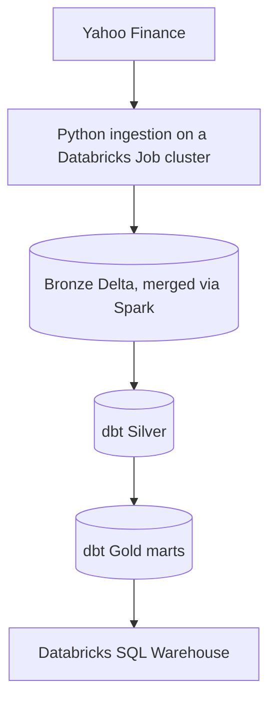

# ETF Market Intelligence Pipeline

[](https://www.python.org/)
[](https://www.getdbt.com/)
[](https://www.databricks.com/)

A data engineering portfolio project that pulls daily ETF prices from Yahoo Finance, lands them in Databricks, and builds them up through a Bronze, Silver, and Gold medallion layout using dbt. The whole thing runs on a schedule inside a Databricks Job, no manual steps once it's set up.

It tracks 20 USD listed ETFs spanning US, global, international, emerging market, technology, bond, and commodity exposure.

**Where things stand:** the historical load, the Medallion layers, the dbt models and tests, and all five Gold marts are done. A Databricks Job runs daily: it pulls the latest prices straight into Bronze, then builds and tests Silver and Gold. Next up is a dashboard built natively in Databricks on top of the Gold marts, with its own refresh added as a third task in that same Job.

## Project Snapshot

As of 24 July 2026, the first day the pipeline ran on its own without anyone triggering it:

| Metric | Value |
| --- | ---: |
| ETFs tracked | 20 |
| Bronze price records | 58,100 |
| Historical range | 2015-01-02 to 2026-07-23 |
| Duplicate (symbol, price_date) keys | 0 |
| dbt models | 6 |
| dbt data tests | 82 |
| Gold analytical marts | 5 |
| Storage format | Delta |

These numbers move every day now that the incremental load is automated, so treat this as a snapshot rather than a fixed count.

## Why This Project Matters

This project is meant to show what a real data engineering workflow looks like end to end, not just the SQL. A few things it covers:

- Configuration driven ingestion in Python, so adding a new ETF is a one line config change, not a code change.
- A historical bootstrap kept separate from the daily incremental load, each with its own script.
- Idempotent loads: the daily job merges into Delta directly from Spark, so running it twice never doubles anything up.
- A scheduled Databricks Job with real dependencies between its tasks.
- A proper Medallion layout in Databricks, with dbt sources, models, and tests doing the transformation work.
- Data quality enforced at the table level, not just checked by eye.
- Full lineage on every row, batch IDs and ingestion timestamps carried all the way through.

## Architecture



### Historical Bootstrap

`fetch_historical_prices.py` pulls the full daily history for every ETF back to 2015 and merges it straight into Bronze, the same way the daily job does. No local CSV, no seed file, just a Spark merge running inside a Databricks Job task. This is what built the original Bronze baseline, and because the merge is idempotent, it also doubles as a repair tool: if the daily job ever misses a day or fails outright, running this script again backfills whatever's missing without creating duplicates.

```text
yfinance historical download (per ETF, from 2015)
        → pandas batch in memory
        → Spark DataFrame (temp view)
        → MERGE INTO bronze.etf_prices_raw
```

### Daily Incremental Load

Each day, the pipeline asks for just the newest candle per ETF and merges that small batch into Bronze. There's no landing file involved anywhere in this path.

```text
Latest daily ETF records
        → pandas batch in memory
        → Spark DataFrame (temp view)
        → MERGE INTO bronze.etf_prices_raw
        → dbt build: Silver and Gold
```

The merge matches on symbol and price_date. Run it twice for the same day and the second run just updates the existing rows instead of duplicating them. `etf_prices_raw` is defined as a dbt source rather than a dbt model, since the Job populates it directly. Silver reads it with `{{ source('bronze', 'etf_prices_raw') }}`.

### Daily Orchestration

One Databricks Job, `etf_daily_pipeline`, runs the whole thing:

| Task | Type | What it does | Status |
| --- | --- | --- | --- |
| `fetch_incremental_prices` | Python script (Git source) | Pulls the latest daily candle for all 20 ETFs and merges into Bronze | Live |
| `build_silver_gold` | dbt | Runs `dbt build --select silver gold`, depends on the fetch task | Live |
| refresh dashboard | Databricks dashboard refresh | Refreshes the native dashboard once Gold is rebuilt | Planned |

Both live tasks pull the current `main` branch fresh on every run, so a push to GitHub is all it takes to change what runs next. The third task gets added once the dashboard itself is built.

## Medallion Architecture

| Layer | Purpose | Main output |
| --- | --- | --- |
| Bronze | Preserve source values and ingestion metadata at daily ETF grain | `bronze.etf_prices_raw` |
| Silver | Clean, standardize, validate, and calculate daily price movements | `silver.etf_prices_cleaned` |
| Gold | Publish business ready performance, market, risk, and alert datasets | Five analytical marts |
| Serving | Query curated Gold data through Databricks SQL | Databricks SQL Warehouse |

### Bronze Layer

The Bronze Delta table keeps the original market fields alongside operational metadata:

```text
symbol, price_date, open, high, low, close, adjusted_close, volume,
source_provider, load_type, batch_id, ingested_at_utc
```

Grain: one row per ETF per trading date.

### Silver Layer

`silver.etf_prices_cleaned` standardizes the raw field names, drops records missing required fields, and rejects rows where high comes in lower than low. It also adds a few calculated columns: the previous adjusted close, daily return and return percentage, and a five day adjusted close comparison. Source and batch lineage carry through, so a Silver row can always be traced back to where it came from in Bronze.

### Gold Analytical Marts

| Model | Grain | Business purpose |
| --- | --- | --- |
| `etf_long_term_performance` | One row per ETF | First and latest prices, total return since 2015 |
| `etf_month_by_month_performance` | One row per ETF per month | Monthly movement, return, and trading day count |
| `etf_monthly_market_summary` | One row per month | Market breadth, average return, and monthly leaders |
| `etf_risk_summary` | One row per ETF | Volatility, positive month ratio, return to risk |
| `etf_alert_candidates` | One row per qualifying ETF/month | Strong gains, sharp drops, momentum events |

Alert thresholds:

| Monthly return | Alert type | Severity |
| ---: | --- | :---: |
| >= 8% | STRONG_GAIN | High |
| <= -8% | SHARP_DROP | High |
| >= 4% | POSITIVE_MOMENTUM | Medium |
| <= -4% | NEGATIVE_MOMENTUM | Medium |

The alert mart is ready for a dashboard to surface. Email delivery on top of it is a later phase.

## ETF Universe

| Symbol | ETF |
| --- | --- |
| VOO | Vanguard S&P 500 ETF |
| SPY | SPDR S&P 500 ETF Trust |
| QQQ | Invesco QQQ Trust |
| VGT | Vanguard Information Technology ETF |
| VT | Vanguard Total World Stock ETF |
| VXUS | Vanguard Total International Stock ETF |
| BND | Vanguard Total Bond Market ETF |
| GLD | SPDR Gold Shares |
| VEA | Vanguard FTSE Developed Markets ETF |
| VWO | Vanguard FTSE Emerging Markets ETF |
| BNDX | Vanguard Total International Bond ETF |
| ACWI | iShares MSCI ACWI ETF |
| EFA | iShares MSCI EAFE ETF |
| IEMG | iShares Core MSCI Emerging Markets ETF |
| EWJ | iShares MSCI Japan ETF |
| MCHI | iShares MSCI China ETF |
| INDA | iShares MSCI India ETF |
| EWG | iShares MSCI Germany ETF |
| EWU | iShares MSCI United Kingdom ETF |
| EWZ | iShares MSCI Brazil ETF |

Symbols live in `config/etf_symbols.yml`. Names and classifications live in `config/etf_metadata.yml`.

## Repository Structure

```text
daily_etf_market_intelligence_pipeline/
├── config/
│   ├── etf_symbols.yml
│   └── etf_metadata.yml
├── data/                              # Generated locally; excluded from Git
│   ├── bootstrap/
│   └── bronze/
├── etf_intelligence_pipeline/
│   ├── dbt_project.yml
│   ├── macros/
│   ├── models/
│   │   ├── bronze/
│   │   │   └── schema.yml             # Declares bronze.etf_prices_raw as a source
│   │   ├── silver/
│   │   └── gold/
│   └── tests/
├── src/
│   ├── ingestion/
│   │   ├── fetch_historical_prices.py  # Databricks Job task; also doubles as a recovery tool
│   │   ├── fetch_incremental_prices.py # Databricks Job task, merges straight into Bronze
│   │   ├── check_bronze_files.py
│   │   └── create_databricks_upload_file.py
│   └── utils/
│       └── config_loader.py
├── .gitignore
├── pyproject.toml
├── uv.lock
└── README.md
```

## Local Setup

The daily ingestion runs on Databricks, not your machine, see Daily Orchestration above. What's local is for developing and testing dbt models.

### Prerequisites

- Python 3.11 or newer
- [`uv`](https://docs.astral.sh/uv/)
- Git
- A Databricks workspace and SQL Warehouse
- dbt Core and `dbt-databricks`

### 1. Clone and install

```powershell
git clone https://github.com/Hamza-Abbas/ETF-Market-Intelligence-Pipeline.git
cd ETF-Market-Intelligence-Pipeline
uv sync
```

### 2. Configure dbt

Store the Databricks connection in `%USERPROFILE%\.dbt\profiles.yml`. Keep secrets out of the repository, and reference environment variables where you can.

Validate the connection:

```powershell
cd etf_intelligence_pipeline
dbt debug
cd ..
```

## Running the Pipeline

### Automated (production)

The `etf_daily_pipeline` Databricks Job handles this on its own schedule, see Daily Orchestration above. Nothing to run manually, check the Job's run history in Databricks if you want to confirm it fired.

### Local dbt development

The ingestion scripts need a live Spark session and only run as Databricks Job tasks, they won't run on your laptop. Silver and Gold still build and test locally against your `profiles.yml`, same as always:

```powershell
cd .\etf_intelligence_pipeline
dbt build --select silver gold
cd ..
```

## Data Quality

82 dbt data tests, plus a handful of custom SQL checks, cover what actually matters here: required fields aren't null, `(symbol, price_date)` stays unique in Bronze and Silver, invalid price ranges get rejected, grains hold steady through Silver and Gold, and a daily batch always has to contain every configured ETF before it's allowed to load.

Bronze row count and date range:

```sql
SELECT
    COUNT(*) AS total_rows,
    COUNT(DISTINCT symbol) AS total_symbols,
    MIN(price_date) AS earliest_date,
    MAX(price_date) AS latest_date
FROM etf_market_intelligence.bronze.etf_prices_raw;
```

Duplicate key check:

```sql
SELECT
    symbol,
    price_date,
    COUNT(*) AS row_count
FROM etf_market_intelligence.bronze.etf_prices_raw
GROUP BY symbol, price_date
HAVING COUNT(*) > 1;
```

## Security

Nothing here gets committed: `.env`, `%USERPROFILE%\.dbt\profiles.yml`, `.venv/`, `logs/`, dbt's `target/` and `dbt_packages/`, and any generated Bronze or bootstrap CSVs.

Before pushing, it's worth a quick look at what's actually staged:

```powershell
git status --short
git diff
git diff --cached
```

## Where Things Stand

| Capability | Status |
| --- | --- |
| Historical ingestion for 20 ETFs | Done |
| Bronze Delta baseline, growing daily | Done |
| Silver transformation layer | Done |
| Five Gold analytical marts | Done |
| dbt tests on Silver and Gold | Done |
| Full ETF names and classifications | Done |
| Daily extractor, merges straight into Bronze via Spark | Done |
| Bronze as a dbt source, no seed step | Done |
| Databricks Job: fetch, then build Silver and Gold | Done |
| Daily schedule | Done |
| Native Databricks dashboard on the Gold marts | Next |
| Dashboard refresh as a third Job task | Next |
| Gmail success and failure notifications | Later |
| Public deployment | Later |

## Roadmap

### Phase 1 — Automated Daily Pipeline (done)

- Validate the daily extraction and Delta merge end to end.
- Run ingestion and dbt through one Databricks Job, `etf_daily_pipeline`.
- Schedule the Job to run daily without anyone touching it.

### Phase 2 — Dashboard and Observability

- Build a dashboard natively in Databricks on top of the Gold marts.
- Add that dashboard's refresh as a third task in the daily Job.
- Add structured run logs, freshness checks, and failure monitoring.
- Report success, no new data, and failure outcomes through Gmail.
- Avoid repeat notifications for alerts already sent once.

### Phase 3 — Analytics Expansion

- Add dashboard and dbt lineage screenshots to this README.
- Extend the analytics with drawdown, annualized volatility, volume, and rolling return views.

## Author

**Hamza Abbas** — Aspiring Data Engineer focused on Python, SQL, dbt, Databricks, Snowflake, cloud data platforms, and analytics engineering.

- [LinkedIn](https://www.linkedin.com/in/hamza-abbas-data-engineer/)
- [GitHub](https://github.com/Hamza-Abbas)

## Disclaimer

This project is built for educational and data engineering portfolio purposes. It isn't financial advice, investment research, or a recommendation to buy or sell any security.
