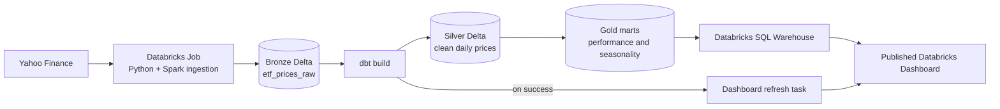
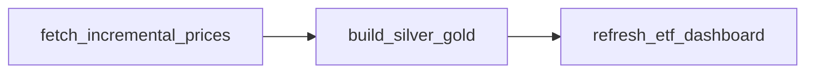
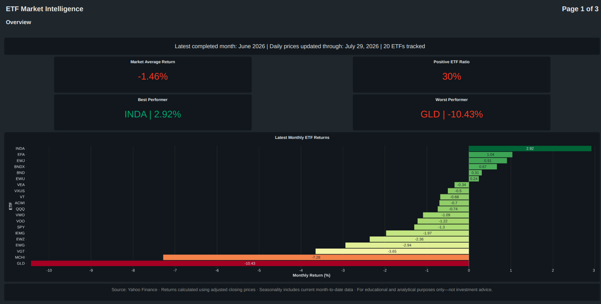
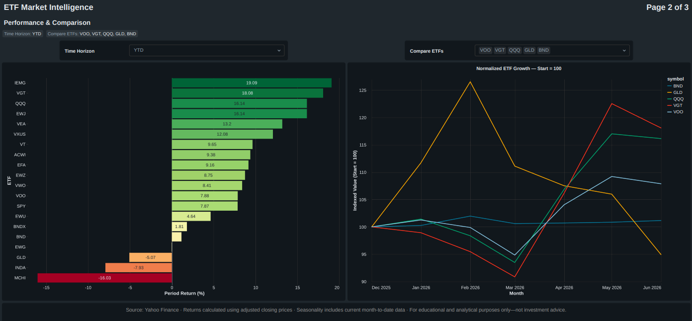
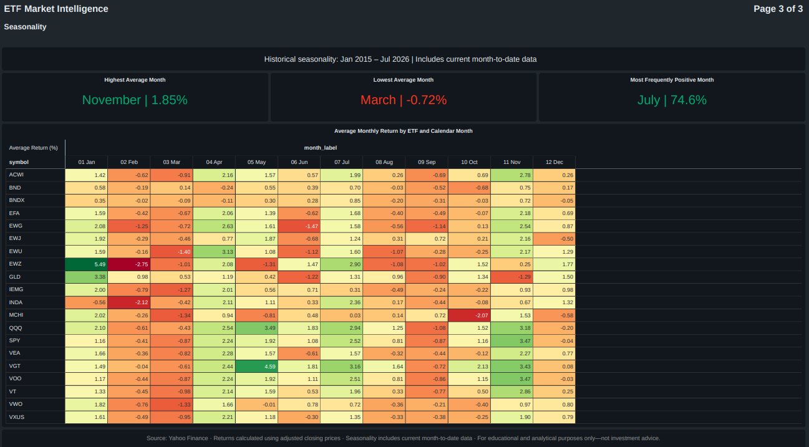

# ETF Market Intelligence Pipeline

[](https://www.python.org/)
[](https://www.getdbt.com/)
[](https://www.databricks.com/)

An automated ETF analytics pipeline that ingests daily market data from Yahoo Finance, stores it in Databricks Delta tables, transforms it through a Bronze–Silver–Gold Medallion Architecture with dbt, and refreshes a native Databricks financial dashboard.

The project tracks **20 USD-listed ETFs** across US equities, international markets, emerging markets, technology, bonds, and commodities.

> **Current status:** the complete cloud workflow is operational. A scheduled Databricks Job fetches the latest ETF prices, merges them into Bronze, runs dbt transformations and tests for Silver and Gold, and refreshes the published dashboard as the final dependent task.

## Project Snapshot

Operational status as of **30 July 2026**:

| Metric | Value |
| --- | ---: |
| ETFs tracked | 20 |
| Historical coverage | From 2015-01-02 |
| Latest automated price date validated | 2026-07-29 |
| Duplicate `(symbol, price_date)` keys | 0 |
| dbt models | 6 |
| dbt data tests | 82 |
| Gold analytical marts | 5 |
| Databricks Job tasks | 3 |
| Dashboard pages | 3 |
| Storage format | Delta |

The row count and latest date increase as new trading data is ingested.

## Why This Project Matters

This project demonstrates an end-to-end Data Engineering workflow rather than only a dashboard or a collection of SQL queries:

- Configuration-driven Python ingestion for a 20-ETF universe.
- Separate historical bootstrap and daily incremental ingestion paths.
- Idempotent Spark `MERGE` logic that prevents duplicate daily records.
- Cloud execution without requiring a local machine to remain online.
- Git-backed Python and dbt code used by Databricks Jobs.
- Bronze, Silver, and Gold layers implemented on Delta tables.
- dbt transformations, source definitions, data tests, and custom SQL tests.
- Task dependencies that stop downstream processing after upstream failure.
- A published Databricks dashboard refreshed automatically after Gold models finish.
- Dynamic data-freshness indicators and parameterized ETF comparisons.
- An exported `.lvdash.json` dashboard definition stored in Git for reproducibility.

## Architecture



## Ingestion Design

### Historical Bootstrap

`fetch_historical_prices.py` downloads the historical daily OHLCV data for each configured ETF from 2015 onward and loads it into Bronze through an idempotent Spark merge.

```text
Yahoo Finance historical download
        → pandas batch
        → Spark DataFrame
        → temporary view
        → MERGE INTO bronze.etf_prices_raw
```

The script can also serve as a recovery or backfill mechanism because rerunning the same dates updates matching keys rather than inserting duplicates.

### Daily Incremental Load

The scheduled incremental task retrieves the newest daily records and merges them directly into Bronze.

```text
Latest daily ETF records
        → pandas batch
        → Spark DataFrame
        → MERGE on symbol + price_date
        → dbt Silver and Gold build
        → dashboard refresh
```

`bronze.etf_prices_raw` is declared as a dbt source because it is populated by the ingestion task rather than built as a dbt model.

## Daily Orchestration

One Databricks Job, `etf_daily_pipeline`, manages the complete dependency chain:

| Order | Task | Type | Responsibility | Status |
| ---: | --- | --- | --- | --- |
| 1 | `fetch_incremental_prices` | Python script from Git | Fetch the latest records for all 20 ETFs and merge them into Bronze | Live |
| 2 | `build_silver_gold` | dbt task | Run Silver and Gold transformations and tests after ingestion succeeds | Live |
| 3 | `refresh_etf_dashboard` | Dashboard task | Refresh the published dashboard after the dbt task succeeds | Live |



The job runs in Databricks, so the pipeline does not depend on a personal laptop or a local scheduler.

## Medallion Architecture

| Layer | Purpose | Main output |
| --- | --- | --- |
| Bronze | Preserve source values and ingestion metadata at daily ETF grain | `bronze.etf_prices_raw` |
| Silver | Clean, standardize, validate, and calculate daily price movements | `silver.etf_prices_cleaned` |
| Gold | Publish business-ready performance, market, risk, and alert datasets | Five analytical marts |
| Serving | Query curated Gold data and deliver interactive analytics | Databricks SQL + Dashboard |

### Bronze Layer

The Bronze table stores source market fields and operational metadata:

```text
symbol, price_date, open, high, low, close, adjusted_close, volume,
source_provider, load_type, batch_id, ingested_at_utc
```

**Grain:** one row per ETF per trading date.

### Silver Layer

`silver.etf_prices_cleaned`:

- Standardizes source field names.
- Filters records missing mandatory values.
- Rejects invalid price ranges where `high < low`.
- Calculates previous adjusted close.
- Calculates daily return and daily return percentage.
- Adds five-day comparison fields.
- Preserves ingestion lineage and batch metadata.

### Gold Analytical Marts

| Model | Grain | Business purpose |
| --- | --- | --- |
| `etf_long_term_performance` | One row per ETF | First and latest prices and total return since 2015 |
| `etf_month_by_month_performance` | One row per ETF per month | Monthly return and trading-period metrics |
| `etf_monthly_market_summary` | One row per month | Market breadth, average return, leaders, and laggards |
| `etf_risk_summary` | One row per ETF | Volatility, positive-month ratio, and return-to-risk metrics |
| `etf_alert_candidates` | One row per qualifying ETF/month | Strong gains, sharp drops, and momentum signals |

Alert thresholds:

| Monthly return | Alert type | Severity |
| ---: | --- | :---: |
| `>= 8%` | `STRONG_GAIN` | High |
| `<= -8%` | `SHARP_DROP` | High |
| `>= 4%` | `POSITIVE_MOMENTUM` | Medium |
| `<= -4%` | `NEGATIVE_MOMENTUM` | Medium |

The dashboard currently focuses on performance and seasonality; the risk and alert marts remain available for later expansion.

## Databricks Financial Dashboard

The native Databricks dashboard is published and refreshed as the final task in the daily pipeline.

### 1. Overview

The landing page presents:

- Latest completed reporting month.
- Latest available daily price date.
- Number of ETFs tracked.
- Market average monthly return.
- Positive ETF ratio.
- Best and worst monthly performers.
- Ranked latest-month ETF returns.



### 2. Performance & Comparison

The performance page supports:

- Dynamic horizons: `1M`, `3M`, `6M`, `YTD`, `1Y`, `3Y`, `5Y`, and `MAX`.
- ETF return ranking for the selected horizon.
- Multi-select ETF comparison.
- Normalized growth from a common starting value of 100.
- Compounded period-return calculations.



### 3. Seasonality

The seasonality page presents:

- Highest average calendar month.
- Lowest average calendar month.
- Most frequently positive calendar month.
- ETF-by-month return heatmap.
- Current month-to-date data in the seasonality calculations.



### Dashboard as Code

The exported Databricks dashboard definition is versioned here:

```text
databricks/dashboards/etf_market_intelligence.lvdash.json
```

The export contains the dashboard pages, SQL datasets, parameters, filters, widget layouts, conditional formatting, and saved defaults. It does not contain the underlying market data or Databricks credentials.

## ETF Universe

| Symbol | ETF |
| --- | --- |
| VOO | Vanguard S&P 500 ETF |
| SPY | SPDR S&P 500 ETF Trust |
| QQQ | Invesco QQQ Trust |
| VGT | Vanguard Information Technology ETF |
| VT | Vanguard Total World Stock ETF |
| VXUS | Vanguard Total International Stock ETF |
| BND | Vanguard Total Bond Market ETF |
| GLD | SPDR Gold Shares |
| VEA | Vanguard FTSE Developed Markets ETF |
| VWO | Vanguard FTSE Emerging Markets ETF |
| BNDX | Vanguard Total International Bond ETF |
| ACWI | iShares MSCI ACWI ETF |
| EFA | iShares MSCI EAFE ETF |
| IEMG | iShares Core MSCI Emerging Markets ETF |
| EWJ | iShares MSCI Japan ETF |
| MCHI | iShares MSCI China ETF |
| INDA | iShares MSCI India ETF |
| EWG | iShares MSCI Germany ETF |
| EWU | iShares MSCI United Kingdom ETF |
| EWZ | iShares MSCI Brazil ETF |

Symbols are maintained in `config/etf_symbols.yml`. ETF names and classifications are maintained in `config/etf_metadata.yml`.

## Repository Structure

```text
daily_etf_market_intelligence_pipeline/
├── config/
│   ├── etf_symbols.yml
│   └── etf_metadata.yml
├── databricks/
│   └── dashboards/
│       └── etf_market_intelligence.lvdash.json
├── docs/
│   └── dashboard/
│       ├── overview.png
│       ├── performance-comparison.png
│       └── seasonality.png
├── etf_intelligence_pipeline/
│   ├── dbt_project.yml
│   ├── macros/
│   ├── models/
│   │   ├── bronze/
│   │   │   └── schema.yml
│   │   ├── silver/
│   │   └── gold/
│   └── tests/
├── src/
│   ├── ingestion/
│   │   ├── fetch_historical_prices.py
│   │   ├── fetch_incremental_prices.py
│   │   ├── check_bronze_files.py
│   │   └── create_databricks_upload_file.py
│   └── utils/
│       └── config_loader.py
├── .gitignore
├── pyproject.toml
├── uv.lock
└── README.md
```

Generated data, local environments, logs, dbt build artifacts, and credentials are excluded from version control.

## Local Setup

The scheduled pipeline executes in Databricks. Local setup is mainly used for developing and validating dbt models.

### Prerequisites

- Python 3.11 or newer
- [`uv`](https://docs.astral.sh/uv/)
- Git
- Databricks workspace and SQL Warehouse
- dbt Core and `dbt-databricks`

### 1. Clone and install

```powershell
git clone https://github.com/Hamza-Abbas/ETF-Market-Intelligence-Pipeline.git
cd ETF-Market-Intelligence-Pipeline
uv sync
```

### 2. Configure dbt

Store the Databricks connection in `%USERPROFILE%\.dbt\profiles.yml`. Do not commit access tokens or connection secrets.

Validate the connection:

```powershell
cd etf_intelligence_pipeline
dbt debug
cd ..
```

## Running the Pipeline

### Automated cloud workflow

The scheduled `etf_daily_pipeline` Databricks Job handles ingestion, transformation, testing, and dashboard refresh automatically.

Check the Databricks Job run history to inspect task status, duration, and failures.

### Local dbt development

```powershell
cd .\etf_intelligence_pipeline
dbt build --select silver gold
cd ..
```

The Spark ingestion scripts are intended to run as Databricks Job tasks rather than as a local production scheduler.

## Data Quality

The project uses **82 dbt data tests** and custom SQL checks covering:

- Mandatory fields.
- Unique `(symbol, price_date)` grain.
- Valid OHLC price relationships.
- Stable grains through Silver and Gold.
- Complete configured ETF batches.
- Null handling in analytical metrics.
- Source-to-model consistency.

Bronze validation:

```sql
SELECT
    COUNT(*) AS total_rows,
    COUNT(DISTINCT symbol) AS total_symbols,
    MIN(price_date) AS earliest_date,
    MAX(price_date) AS latest_date
FROM etf_market_intelligence.bronze.etf_prices_raw;
```

Duplicate-key validation:

```sql
SELECT
    symbol,
    price_date,
    COUNT(*) AS row_count
FROM etf_market_intelligence.bronze.etf_prices_raw
GROUP BY symbol, price_date
HAVING COUNT(*) > 1;
```

## Security

The following are excluded from Git:

- `.env`
- `%USERPROFILE%\.dbt\profiles.yml`
- `.venv/`
- Logs
- dbt `target/`
- `dbt_packages/`
- Generated local market-data files
- Databricks access tokens

Before every push:

```powershell
git status --short
git diff
git diff --cached
```

## Project Status

| Capability | Status |
| --- | --- |
| Historical ingestion for 20 ETFs | Done |
| Bronze Delta baseline and daily growth | Done |
| Silver transformation layer | Done |
| Five Gold analytical marts | Done |
| dbt tests on Silver and Gold | Done |
| Full ETF metadata and classifications | Done |
| Idempotent Spark incremental ingestion | Done |
| Git-backed Databricks Job execution | Done |
| Daily cloud schedule | Done |
| Published three-page Databricks dashboard | Done |
| Dashboard refresh as third Job task | Done |
| Dashboard definition exported to Git | Done |
| Gmail success and failure notifications | Planned |
| Structured operational observability | Planned |
| Public dashboard deployment | Future enhancement |

## Roadmap

### Phase 1 — Core Medallion Pipeline ✅

- Historical ETF ingestion.
- Bronze, Silver, and Gold Delta layers.
- dbt models, sources, tests, and Gold marts.

### Phase 2 — Cloud Automation ✅

- Databricks Git integration.
- Spark incremental ingestion.
- Scheduled Databricks Job.
- Dependent dbt build task.

### Phase 3 — Financial Dashboard ✅

- Native Databricks dashboard.
- Overview, Performance & Comparison, and Seasonality pages.
- Parameterized horizon and ETF filters.
- Automated dashboard refresh task.
- Dashboard screenshots and `.lvdash.json` export.

### Phase 4 — Observability and Notifications

- Structured pipeline-run metrics.
- Data-freshness and row-count alerts.
- Success and failure notifications.
- Notification deduplication.

### Phase 5 — Analytics Expansion

- Drawdown analysis.
- Annualized volatility.
- Rolling returns.
- Trading-volume analytics.
- Expanded alert and risk views.

## Author

**Hamza Abbas** — Aspiring Data Engineer focused on Python, SQL, dbt, Databricks, Snowflake, cloud data platforms, and Analytics Engineering.

- [LinkedIn](https://www.linkedin.com/in/hamza-abbas-data-engineer/)
- [GitHub](https://github.com/Hamza-Abbas)

## Disclaimer

This project is built for educational and Data Engineering portfolio purposes. It is not financial advice, investment research, or a recommendation to buy or sell any security.
